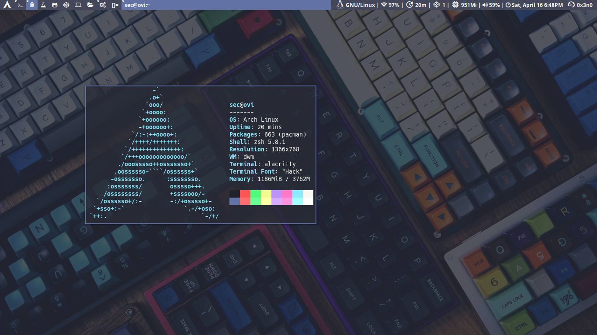

## Keybindings
These are the keybindings for qtile and dwm

| A FEW IMPORTANT KEYBINDINGS | ASSOCIATED ACTION                                                        |
|:--|:--
| MODKEY + RETURN             | opens terminal (alacritty is the terminal but can be easily changed)     |
| MODKEY + SHIFT + RETURN     | opens run launcher (dmenu is the run launcher but can be easily changed) |
| MODKEY + TAB                | rotates through the available layouts                                    |
| MODKEY + SHIFT + c          | closes window with focus                                                 |
| MODKEY + SHIFT + r          | restarts qtile                                                           |
| MODKEY + SHIFT + q          | quits qtile                                                              |
| MODKEY + 1-9                | switch focus to workspace (1-9)                                          |
| MODKEY + SHIFT + 1-9        | send focused window to workspace (1-9)                                   |
| MODKEY + j                  | lazy layout down (switches focus between windows in the stack)           |
| MODKEY + k                  | lazy layout up (switches focus between windows in the stack)             |
| MODKEY + SHIFT + j          | lazy layout shuffle_down (rotates the windows in the stack)              |
| MODKEY + SHIFT + k          | lazy layout shuffle_up (rotates the windows in the stack)                |
| MODKEY + h                  | shrink size of window (MondadTall layout)                                |
| MODKEY + l                  | expand size of window (MondadTall layout)                                |
| MODKEY + w                  | switch focus to monitor 1                                                |
| MODKEY + e                  | switch focus to monitor 2                                                |
| MODKEY + r                  | switch focus to monitor 3                                                |
| MODKEY + period             | switch focus to next monitor                                             |
| MODKEY + comma              | switch focus to prev monitor                                             |

## Instalation DWM

go directly to the directory file `.config/dwm` then compile
```bash
sudo make clean install
```

## Qtile

if you want to use cross qtile install qtile by typing the command line

```bash
sudo pacman -S qtile
```
