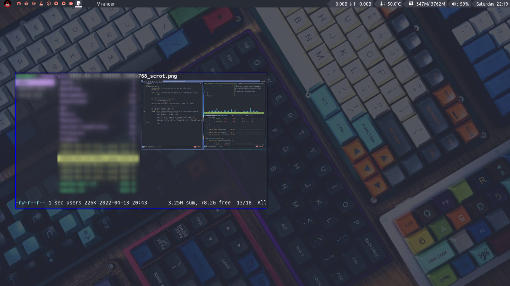
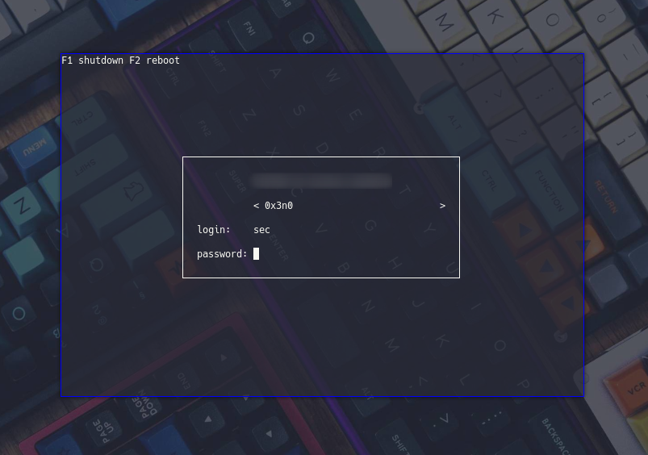

## Dwm

## Qtile

## ly display manager


## Keybindings
These are the keybindings for qtile and dwm

| A FEW IMPORTANT KEYBINDINGS | ASSOCIATED ACTION                                                        |
|:--|:--
| MODKEY + RETURN             | opens terminal (alacritty is the terminal but can be easily changed)     |
| MODKEY + SHIFT + RETURN     | opens run launcher (dmenu is the run launcher but can be easily changed) |
| MODKEY + TAB                | rotates through the available layouts                                    |
| MODKEY + SHIFT + c          | closes window with focus                                                 |
| MODKEY + SHIFT + r          | restarts qtile                                                           |
| MODKEY + SHIFT + q          | quits qtile                                                              |
| MODKEY + 1-9                | switch focus to workspace (1-9)                                          |
| MODKEY + SHIFT + 1-9        | send focused window to workspace (1-9)                                   |
| MODKEY + j                  | lazy layout down (switches focus between windows in the stack)           |
| MODKEY + k                  | lazy layout up (switches focus between windows in the stack)             |
| MODKEY + SHIFT + j          | lazy layout shuffle_down (rotates the windows in the stack)              |
| MODKEY + SHIFT + k          | lazy layout shuffle_up (rotates the windows in the stack)                |
| MODKEY + h                  | shrink size of window (MondadTall layout)                                |
| MODKEY + l                  | expand size of window (MondadTall layout)                                |
| MODKEY + w                  | switch focus to monitor 1                                                |
| MODKEY + e                  | switch focus to monitor 2                                                |
| MODKEY + r                  | switch focus to monitor 3                                                |
| MODKEY + period             | switch focus to next monitor                                             |
| MODKEY + comma              | switch focus to prev monitor                                             |

| Keybinding       | Action                                                                       |
|:--|:--
| MODKEY + ALT + b | open Chromium browser                                                        |
| MODKEY + ALT + s | tabbed -r 2 surf -pe x '.surf/html/homepage.html'                            |
| MODKEY + ALT + t | open telegeam                                                                |
| MODKEY + ALT + f | open [pcmanfm (PaCMANFileManager)](https://wiki.archlinux.org/title/PCManFM) |


| Details                     |                   |
|:--|:--
| operating system            | Arch Linux        |
| Display manager             | Ly manager        |
| Terminal                    | ST and alacritty  |
| WM                          | Qtile and DWM     |

## Installation DWM
directly to the .config/dwm directory file and then compile
```bash
sudo make clean install
```

## Installation dwmblocks
go to dwmblocks directory `.config//dwm/dwmblocks`
```bash
sudo make clean install
```

## Qtile
if you want to use qtile, install qtile by typing command line

```bash
sudo pacman -S qtile
```
then create a ```qtile.desktop``` file in the directory `/usr/share/xssesions` it applies if you use ly manager if you don't use `ly display manager` please find out for yourself

```bash
[Desktop Entry]
Name=0x3n0
Comment=Qtile Session
Exec=qtile start
Type=Application
Keywords=wm;tiling
```

### Package
+ `libxft-bgra`
+ `st`
+ `dmenu`
+ `rofi`
+ `feh`
+ `nitrogen`
+ `ranger`
+ `ttf-mono`
+ `ttf-nerd-font`
+ `ttf-joypixels`
+ `alacritty`
+ `dwmblocks`
+ `starship`

